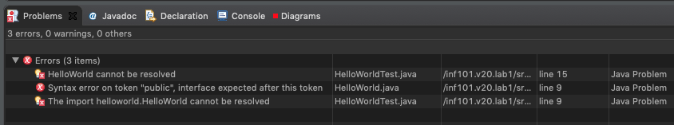

# Lab 1

_Dette dokumentet beskriver første lab for INF101 - vår 2020._

Denne lab-oppgaven inneholder tre oppgaver.

- 1.1 [Feilmeldinger](#11-feilmeldinger)
- 1.2 [Cæsarcipher](#12-cæsarcipher)
- 1.3 [Chatbot](#13-chatbot)

Vi anbefaler at du gjør 1.1 først fordi den vil hjelpe deg å debugge koden i de neste to oppgavene. Du trenger ikke gjøre 1.2 og 1.3 i rekkefølge. Hvis du sitter fast på én oppgave kan det hjelpe å jobbe litt på den andre.

## Hva er en lab-oppgave?

Lab-oppgavene er pensum i emnet og dekker essensiell kunnskap som du vil trenge i senere obliger og på eksamen. De er ikke obligatoriske og skal ikke leveres inn. For å få tilbakemelding på dem må du gå på gruppe og snakke med gruppeleder. Oppgaver som ikke er essensielle vil bli markert som valgfri.

**Dersom du ikke gjør de essensielle oppgavene vil du miste en essensiell del av INF101-undervisningen.**

De valgfrie oppgavene er gode utgangspunkt for å jobbe videre med kodeprosjekter sammen med andre studenter eller for deg selv.

Hver uke er det 'labber', eller 'grupper', hvor du kan få hjelp fra gruppeleder til å løse oppgaver, sjekke koden din eller svare på INF101-spørsmål. Alle har noe å gjøre på INF101 gruppe:

- Hvis koden din _ikke_ funker kan du få hjelp fra gruppeleder eller andre studenter.
- Hvis koden din _funker_ kan du få hjelp til å forbedre den eller forstå den bedre fra gruppeleder eller andre studenter.
- Hvis du har fått til noe og noen andre ikke har, kan du forbedre forståelsen din ved å hjelpe andre studenter som sitter fast. _Men spør først om de vil ha hjelp fra deg._

Gruppene vil bli veldig fulle senere i semesteret når det blir oblig-tid. De første ukene er en unik mulighet til å få mye oppfølging fra gruppeleder.

## 1.0 Sjekk ut koden fra GitLab

Bruk [denne GitLab-guiden](gitlab.md) for å få tilgang til din GitLab-konto og klone dette repositoriet. Til denne oppgaven trenger du ikke å gå forbi steg 3 (Clone) i GitLab-guiden.

### Troubleshooting: Setup

Åpne Hello World-filen i sin egen editor i Eclipse. 

Hvis du ikke har lastet prosjektet inn i Eclipse kan du gjøre det ved å først klone det til pcen din, deretter importere det som nytt Maven-prosjekt i Eclipse. 

Når det dukker opp i Project View kan du navigere i mappene og filene. Under pakkene `inf101.v20.ex01.helloworld` ligger HelloWorld.java. 

Åpne filen ved å dobbelklikke på den. Du får da se innholdet i en egen teksteditor, med highlighting.

```java
public class HelloWorld {
...
```

## 1.1 Feilmeldinger

_I denne oppgaven skal du utforske Java-feilmeldinger i IDEet og i terminalen ved å introdusere feil i et program._

Du vil ha nytte av å introdusere feilmeldinger i programmet ditt på en kontrollert måte slik at når du møter på dem "in the wild" (for eksempel rett før en oblig-innlevering) har du allerede sett dem og vet hvordan du går frem for å fikse dem.

### 1.1.0 Intro: Hva er en feilmelding

I forrige uke skrev vi `Hello World` til kommandolinja og Eclipse-konsollen. Denne uka skal vi bruke Hello World-programmet til å lage _feilmeldinger_.

I motsetning til Python, er Java et _kompilert_ språk. IDEer som Eclipse inneholder en kompilator og andre språkverktøy som fungerer litt som en stavekontroll i Microsoft Word: når du skriver noe feil får du opp en rød strek og en feilmelding, og ofte et tips til hvordan du kan fikse det. Dette kommer til å bli et nyttig verktøy for deg og kanskje har du alt opplevd å få feilmeldinger. Ut over våren vil du få mange. Jo raskere du lærer deg hva de betyr og hvordan du skal fikse dem, jo mer kan du dra nytte av Eclipse heller enn å bruke tid på å nøste opp i kode selv.


### 1.1.1 Min første feilmelding

_I denne deloppgaven skal vi få Eclipse til å vise oss tre feilmeldinger og deretter fikse dem._

Åpne HelloWorld.java i Eclipse. Finn [keywordet](https://en.wikipedia.org/wiki/List_of_Java_keywords) `class`. Slett det, og lagre filen.

✅ Sjekk at du får en rød-stiplete linje under `public`.  
✅ Sjekk at du får opp røde bokser med hvite kryss i på filen (og pakken og mappen og prosjektet) i Project Explorer vinduet i Eclipse.  
✅ Finn Problems-view og sjekk at du har 3 errors:



Legg merke til at én feil er i HelloWorld-klassen, mens de to andre kommer fra test-klassen. Når HelloWorld-klassen har _syntax-feil_ kan den ikke kompileres, og andre klasser kan ikke bruke den. Vi kan heldigvis løse alle tre på én gang.

✅ I kode-editoren der HelloWorld.java er åpen, hover musepekeren over Error-symbolet i gutter-området (til venstre for linjenummer 9). Sjekk at du får opp boksen med en tekstbeskrivese av feilen.  
✅ Når du får opp boksen i forrige steg, trykk på den, marker feilmeldingsteksten og kopier den. Paste den i et nettsøk (f.eks. Google) og se hva andre sier om den.  
✅ Vi vet at feilen i vår kode er manglende `class`-keyword. Passer alle anbefalingene med feilen i vår kode? Finn minst én som du tror ville hjulpet deg å løse en slik feil.

#### Lag din egen feilmelding-oversikt

_Det er valgfritt å lage sin egen feilmeldings-oversikt, men vi anbefaler at du gjør det for din egen del._

Noter _din egen beskrivelse_ av hvilke feilmeldinger du får, hvorfor, og hva du gjorde for å fikse dem. Du kan velge selv om du syns det er mest praktisk å kopiere feilmeldings-teksten eller å skrive din egen beskrivelse, men husk at noen deler av teksten vil forandre seg når du har andre variabel- og klassenavn. Dette vil vi se mer av i neste deloppgave.

Når du har notert feilmeldingene kan du prøve å fikse dem. Husk at i dette tilfellet fikk vi opp alle tre når vi slettet keywordet `class`. Det er derfor lett å fikse, enten ved å skrive inn `class` på riktig sted, eller ved å trykke **undo** til programmet er tilbake til sin originale form.

✅ **Du kan gå videre når du har fått opp en feilmelding i Java-editoren i IDEet ditt, gjort et nettsøk på feilmeldingsteksten, og fått den til å gå bort igjen.**

Kjør HelloWorld.java fra Eclipse og sjekk at Hello World blir skrevet ut til terminalen før du går videre.

#### Troubleshooting

- Problems view finnes typisk i en tab ved siden av Eclipse-konsollen når du er i Java Perspective modus. Hvis det ikke vises kan du legge det til selv under menyen Window -> Show View -> Problems.
- Hvis du bruker IntelliJ eller en annen editor vil denne oppgaven se annerledes ut for deg. Feilmeldingene vises på en litt annen måte, og du må tukle litt med instillingene for å få det vinduet som tilsvarer Problems view til å vises.
- Hvis du ikke får feilmeldinger når du har feil i Java-koden så er sannsynligvis koden din ikke lastet inn som et Java-prosjekt. Spør gruppeleder.

### 1.1.2 Feilmeldinger, quick fixes og bugs..

_I denne deloppgaven skal vi utforske hvilke feilmeldinger Eclipse og terminalen gir oss og hva de betyr. Vi skal introdusere en bug i programmet vårt ved hjelp av Eclipse sin quick-fix-meny og deretter fikse den._

**NB: Start med det originale inf101.v20.lab1.helloworld.HelloWorld.java-programmet åpent i Eclipse.**

For hver kode-endring beskrevet skal du:

- gjør endringen i koden din
- finn stedet som viser feil i gutter og i javakoden
- finn feilmeldingsteksten og les den 
	- valgfritt: Google feilen og se hva andre anbefaler  
   - valgfritt: notér feilen og en beskrivelse i feilmeldings-notatet ditt
- fiks feilen - enten manuelt ved å skrive koden selv - eller ved å trykke **undo** til klassen din er korrekt igjen.

**NB: Det er viktig at du følger oppgaveteksten helt nøyaktig. Hvis du får en annen feil enn beskrevet, les stegene om igjen og sjekk at du gjorde det helt nøyaktig likt.**

#### Kodeendringer:

✅ Slett `{` på linje 9.  
`Syntax error on token "HelloWorld", { expected after this token`

✅ Slett `}` på linje 24.  
`Syntax error, insert "}" to complete ClassBody`

✅ Slett `;` på linje 12.  
`Syntax error, insert ";" to complete BlockStatements`

✅ Slett `;` på linje 13.  
Er det samme feil som i sta?

✅ Slett `helloWorld` på linje 13.  
Ingen feil, men finn én warning på linje 12: `The value of the local variable helloWorld is not used`

✅ Slett `args` på linje 11.  
Finn 4 feil før du lagrer filen, og 1 etter.

✅ Slett `)` på linje 11.  
Hva er en MethodDeclaration?

✅ Skriv `Hello World` på linje 10.

✅ Gjør en valgfri kodeendring.

Du kan alltid utforske programmer selv på denne måten. Bare husk å pass på at du kan få det tilbake til opprinnelig tilstand.

#### QuickFix

Noen ganger kan IDEet tilby oss en _quickFix_. Nå skal vi introdusere en feil og reparere den med quickFix-funksjonaliteten til Eclipse på flere forskjellige måter. Vi skal se hvordan quickFix kan enten reparere koden slik vi vil, eller introdusere en **bug** i koden vår som fort kunne tatt lang tid å finne.

TL;DR: Quickfix er nyttig når den er brukt riktig, men kan introdusere vanskelig bugs hvis man trykker på ting man ikke er sikker på hva gjør!

**NB: Før du starter disse stegene, sjekk at du har et originalt, fungerende HelloWorld-program åpent i Eclipse. Kjør programmet fra Eclipse og sjekk at Hello World skrives ut til konsollen.**

✅ Slett `String` på linje 12  
Dette gir 2 feil, på linje 12 og 13.

✅ Hover over feilen på linje 13, sjekk at du får opp `4 quick fixes available`-vinduet.

✅ I vinduet, trykk på valget `create local variable helloWorld`. Hva skjedde? Hvilken feil får du opp nå?

**NB: undo og lagre filen. Før du går videre skal du fremdeles ha feilene på linje 12 og 13.**

✅ Hover over feilen på linje 12, sjekk at du får opp `4 quick fixes available`-vinduet igjen.

✅ I vinduet, trykk på valget `create local variable helloWorld` igjen. Hva skjedde? Hvorfor har du ingen feil i programmet denne gangen?

**NB: undo og lagre filen. Før du går videre skal du fremdeles ha feilene på linje 12 og 13.**

Denne gangen var tilfeldigvis valget `create local variable helloWorld` øverst i listen av quick fixes. La oss velge noe annet fra listen og introdusere en feil som **ikke** gir oss feilmelding, eller en **bug**.

✅ Hover over feilen på linje 12 igjen og trykk på valget `create parameter helloWorld`. Hva skjedde? Hvorfor har du ingen feil i programmet denne gangen?

**NB: lagre filen**

Prøv å kjøre filen ved å høyreklikke og trykk `run as`. Hvis du har følgt stegene får du ikke lenger opp `Java Application`, men bare `Run Configurations`. Legg merke til at Eclipse gir oss ingen feilmelding.

Hvordan tror du du ville prøvd å løse dette selv? Prøv deg gjerne litt frem før du går videre i oppgaven.

Når du vil gå videre kan du åpne et terminal-vindu og naviger til mappen HelloWorld.java ligger i. Prøv å kjøre programmet ditt fra terminalen slik vi gjorde i forrige uke:

```
> java HelloWorld.java
error: can't find main(String[]) method in class: helloworld.HelloWorld
```

**Endelig en feilmelding!** Nå kan vi finne ut hva som har gått galt.

Method `main(String[])` finnes ikke i HelloWorld, fordi vi har lagt til et ekstra parameter og gjort den om til `main(String[], String)`. Java-applikasjoner kan bare kjøres hvis det finnes en metode med _signaturen_ `main(String[])` i dem.

Gå tilbake til Eclipse og fiks programmet ditt igjen, enten ved hjelp av undo, eller manuelt ved å fjerne `, String helloworld` fra linje 11, og skrive `String` foran `helloWorld =` på linje 12. Høyreklikk og Run As -> Java Application. Sjekk at Hello World skrives ut til konsollen.

✅ Du kan gå videre når du har fått Eclipse's quick fix til å introdusere en bug i programmet ditt og rettet den opp igjen. **Good job!**

#### Troubleshooting

- Husk å lagre programmet
- Hvis du ikke klarer å få programmet tilbake til opprinnelig form kan du spørre en venn eller gruppeleder om hjelp til å gjøre det via git. Eventuelt bare kloner du prosjektet på nytt.

## 1.2 CæsarCipher

_I denne oppgaven skal du lære å manipulere strenger ved hjelp av character-encoding og matematiske operasjoner._

En naiv krypteringsteknikk kalt Cæsarchiffer kan brukes til å kryptere [Strings](https://docs.oracle.com/en/java/javase/13/docs/api/java.base/java/lang/String.html) ved å flytte hver karakter i strengen frem eller tilbake et bestemt antall steg i alfabatet. Hvis vi bruker teknikken på ’abc’ med 5 steg får vi ’fgh’. Vi ser på alfabetet som en sirkulær struktur, så hvis du går til høyre forbi ’z’ så kommer du rundt til ’a’, og hvis du går andre veien forbi ’a’ så kommer du til ’z’. I Oppgave 1.2 skal vi lage et program som krypterer og dekrypterer for oss. Du kan tenke deg at kryptering flytter bokstaver "til høyre" i alfabetet, mot slutten, mens dekryptering flytter bokstaver "til venstre", mot starten. 

Vi beveger oss kun langs det engelske alfabetet.

*Hvis dette høres kjent ut så husker du kanskje ukesoppgave 4.4 fra INF100 i høst. Hvis du har løst oppgaven før så kan du gjerne se på python-koden din.*

For å bryte ned problemet med å enkode en hel String, kan vi tenke på en String som en array av bokstaver (char). 

```java
"Hello World" = ['H', 'e', 'l', 'l', 'o', ' ', 'W', 'o', 'r', 'l', 'd']
```

For å enkode et String-objekt må vi erstatte hver bokstav med `steg` mange posisjoner til 'høyre' (mot enden av alfabetet).

```java
encrypt("Hello World", 5) = ['M', 'j', 'q', 'q', 't', ' ', 'B', 't', 'w', 'q', 'i'] = "Mjqqt Btwqi". 
```

Legg merke til at vi ikke krypterer mellomrom `" "`. Tenk på det som en "special case" (og sjekk hvordan testene behandler mellomrom). 

*Tips: i denne oppgaven inneholder koden TODOs som hjelper deg å finne hvor du skal gjøre endringer.*

### 1.2.1 `shiftCharacter(char, int)`
Vi starter med å implementere metoden `CaesarCipher.shiftCharacter(char, int)` i CeasarCipher. 

**Tips: start med å skrive kode for "base case".** 

Når `steps` er 0 er det bare å returnere samme bokstav. Dette sjekkes av testene `testShiftCharacterReflexive`. Prøv å få dem til å passere før du går videre. 

Når `steps` er noe annet enn 0 er det verre. Du må nok implementere støttemetoden `nextIndex` for å finne den riktige bokstaven. 

Her er forslag til fremgangsmåte: 

- Finn indeksen til bokstaven 
- Trekk fra indeksen til `'a'`
- Legg til `steg` til den nye indeksen, og ta resultatet modulo (`%`) antall karakterer i alfabetet. 
- Legg den nye indeksen til `'a'`
- Konverter tilbake til bokstav

Tips: prøv gjerne ut debugging i Eclipse hvis du har problemer med indekser. Spør en gruppeleder om hjelp til å teste det ut. 

### 1.2.2 `encrypt(String, int)`
I denne oppgaven skal du lage funksjonen encrypt(String, int) som tar to parameter `String tekst` og `int steg`. Funksjonen skal kryptere strengen ved å flytte alle karakterene i strengen `steg` antall steg i alfabetet og returnere den krypterte strengen. 

Tips: Bruk en løkke eller stream som itererer over karakterene i tekst.

Bruk encrypt-testene til å sjekke hvordan metoden din ligger an. 

### 1.2.3 `decrypt(String, int)`
I denne oppgaven skal du lage funksjonen decrypt, som gjør det motsatte av enkrypt. Se på testene for å skjønne hva den skal gjøre, og prøv å implementer den. 

Tips: bruk funksjonen encrypt til å implementere decrypt. 

### 1.2.4 Kommandolinje
I denne oppgaven skal du implementere kommandolinje-interaksjon med programmet ditt. 

Så langt har du nok brukt testene til å sjekke metodene dine? Nå skal vi gjøre det mulig å bruke krypteringsfunksjonaliteten via konsollen i Eclipse. Prøv å kjøre CaesarCipher.java. Hvis du ikke har endret på main-metoden så skal du få skrevet ut

```
Dette programmet kan kryptere og dekryptere strenger ved hjelp av CaesarCipher.
Skriv "encrypt" dersom du vil kryptere en streng og "decrypt" dersom du vil de-kryptere en streng.
```

*Eclipse-tips: Du kan se at programmet enda kjører ved at den røde firkanten i konsoll-gutteren er der. Hvis du trykker på den stopper du programmet.*

Programmet kjører til du skriver inn en streng, men så stopper det av seg selv. 

Målet med denne oppgaven er å kunne ha de følgende to interaksjone med programmet: 

```
Dette programmet kan kryptere og dekryptere strenger ved hjelp av CaesarCipher.
Skriv "encrypt" dersom du vil kryptere en streng og "decrypt" dersom du vil de-kryptere en streng.
encrypt
Skriv inn en streng du vil kryptere: Hello World
Skriv inn antall steg krypteringen skal bruke: 5
Mjqqt Btwqi
```
og

```
Dette programmet kan kryptere og dekryptere strenger ved hjelp av CaesarCipher.
Skriv "encrypt" dersom du vil kryptere en streng og "decrypt" dersom du vil de-kryptere en streng.
decrypt
Skriv inn en streng du vil dekryptere: Mjqqt Btwqi
Skriv inn antall steg krypteringen skal bruke: 5
Hello World
```

Gjør ferdig main-metoden slik at programmet kan brukes på denne måten. 

### 1.2.5 Kjør til bruker sier stopp (Valgfritt)

Nå må vi kjøre programmet på nytt for hver gang vi vil kryptere eller dekryptere en streng. Klarer du å implementere en loop i main-metoden som gjører til brukeren skriver "stopp"?

Tips: Se på hvordan Main-klassen i Chatbot-oppgaven er implementert.

## 1.3 Chatbot

_I denne oppgaven skal du lære å lese tekst fra input, skrive ut til terminal, å manipulere strenger, og å bruke tabeller som datastruktur_

En [chatbot](https://en.wikipedia.org/wiki/Chatbot) er et program som kan konversere via tale (f.eks. [Alexa](https://en.wikipedia.org/wiki/Amazon_Alexa) og [Google Assistant](https://en.wikipedia.org/wiki/Google_Assistant)) eller tekst. Slike programmer er ofte designet for å simulere hvordan et menneske vil oppføre seg i en dialog. I denne oppgaven har du fått utlevert et veldig dårlig chatbot-program.

Prøv å kjøre Main.java i chatbot-pakken. Konsollen vil vise:

```
null
User: 
```
Woops. Start med å lese Main.java-klassen og se om du skjønner hva som foregår. 

*Eclipse-tips: du kan navigere fra et metode-kall til en metode-deklararasjon ved å høyreklikke og trykke 'Open Declaration'.* 

**NB: I denne oppgaven er det ingen TODOs. Du må selv finne ut hvor i koden du må gjøre endringer for å få programmet til å funke.**


### 1.3.1 `Hello, I am a bot.`

Se om du finner ut hvorfor boten skriver ut null i stedet for en velkomst-hilsen, og fiks det. Se om du finner de relevante testene og få dem til å passere. 

### 1.3.2 `Stopp`

Etter at du har fikset velkomst-hilsenen kan du holde en dialog med boten. 

```
Bot: Hello, I am a bot.
User: hei
Bot: Hei!
User: hallo
Bot: Hello, I am a bot.
User: hvordan går det?
Bot: Hello, I am a bot.
User: hva kan du gjøre?
Bot: Hello, I am a bot.
User: help
Bot: Hello, I am a bot.
```
Den er ikke en veldig god samtalepartner. 

```
Bot: Hello, I am a bot.
User: stop
Bot: Hello, I am a bot.
User: stopp
Bot: Hello, I am a bot.
User: STOP
Bot: Hello, I am a bot.
User: 
```
I denne oppgaven skal du implementere en kommando for å stoppe chatbot-programmet. Kommandoen defineres når chatbot-objektet opprettes, i dette tilfellet er det i Main.java, på linje 7. Du kan endre den til å være hva som helst (f.eks. 'stop', 'done', 'shuttup', etc), men **legg merke til at kommandoen skal være case insensitive**. 

Gjør endringene som trengs i chatbot-klassen slik at stopp-funksjonaliteten fungerer. 

Når du har gjort dette riktig vil alle chatbot-testene passere.

**Kodenøtt: Hvorfor er det én test som allerede passerer?**

Tips til fremgangsmåte: 

- stopCondition er en *feltvariabel* i chatbot-objektet, og brukes til å holde på verdier som objektet trenger i løpet av sin levetid. 
- feltvariabler vil typisk *initialiseres* i objektet sin *konstruktør*. 
- feltvariabler kan leses i *instansmetoder*, i.e. metoder som *ikke* er static og dermed tilhører objektet i stedet for typen. Alle metodene i Chatbot.java er instansmetoder. 

### 1.3.3 `Hva heter du?`
Når testene passerer og du har implementert stopp-kommando er det tid for å utvide repertoaret av samtaleemner. Boten har en strengtabell  av mulige svar lagret i feltvariabelen `RESPONSES`. Metoden `getResponses(String)` er ansvarlig for å velge respons fra listen. Legg merke til at selv om tabellen inneholder strengen "Bot: Hva heter du?" så blir den aldri valgt. 

Utvid koden til å kunne skrive ut denne verdien. Bruk gjerne en [Random boolean](https://docs.oracle.com/en/java/javase/13/docs/api/java.base/java/util/Random.html#nextBoolean()) til å velge om du skal skrive ut responsen på posisjon 0 eller posisjon 2 i tabellen. 

Du er ferdig når du kan få programmet til å skrive ut `"Bot: Hva heter du?"` til konsollen. 

### 1.3.4 Legg til din egen respons
Chatboten vår har helt klart mye forbedringspotensiale. Den enkleste måten å forbedre den på er å legge til nye responser i tabellen. Legg til en eller flere egne responser i tabellen, og endre koden du skrev i 1.3.4 til å tilfeldig velge en respons fra alle mulige. 

*Tips: Du må kanskje bytte ut din Random boolean med en Random int. Pass på at heltallsverdien er en gyldig index i tabellen.*

### 1.3.5 Utvid med egen logikk (Valgfritt)
Når du først har begynt å legge til egne responser, kan det være du vil legge til din egen logikk for hvordan boten skal velge responser. 

Ved hjelp av `input.contains(...)`-metoden kan du lete etter ord i brukeren sitt input, og velge hva boten skal si basert på det. 

Tips: Hvis du får veldig mange if-else-sjekker kan du vurdere å bytte dem ut med switch-case. 